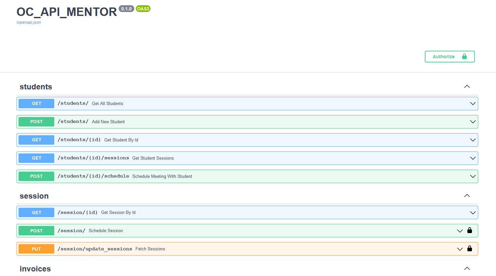

API for OpenClassRooms mentoring:

- Save sessions to mongoDB
- Save students to mongoDB
- Manage and generate Invoices from mongoDB aggregation

Swagger accessible on:
http://localhost:3000/docs



# Quick Start
## Run from your computer
Requirements
- MongoDB (configure uri in /app/core/config)
- Python 3.8+


from app folder:
````bash
pip install -r requirements.txt
python3 /app/main.py
````

## Run from docker
Requirements:
- Docker or Docker Desktop running

````bash
docker-compose up -d
````

# Fecth your mentoring info
## Authenticate 
 - If you use the swagger use the authenticate button from the upper right corner.
Then fill password and username from OpenClassRoom (OC), 
it will fetch necessary cookies and token to be able to interact 
with OC website and api.

 - From your front-end just hit the "/token" endpoint

## Fetch Sessions
The endpoint "session/update_session" will request to the OC api all the sessions.
Also Fetch for new student, their information (email, status...)
Only session which are not in DB will be stored.

## Get Invoice for the month
On the endpoint "/invoice/" (POST), add the year (4 digits) and the month (2 digits).
From the sessions of the DB it will aggregate required ones, to generate an invoice.


# Upcomming features
- Schedule a session with a student
- Write report
